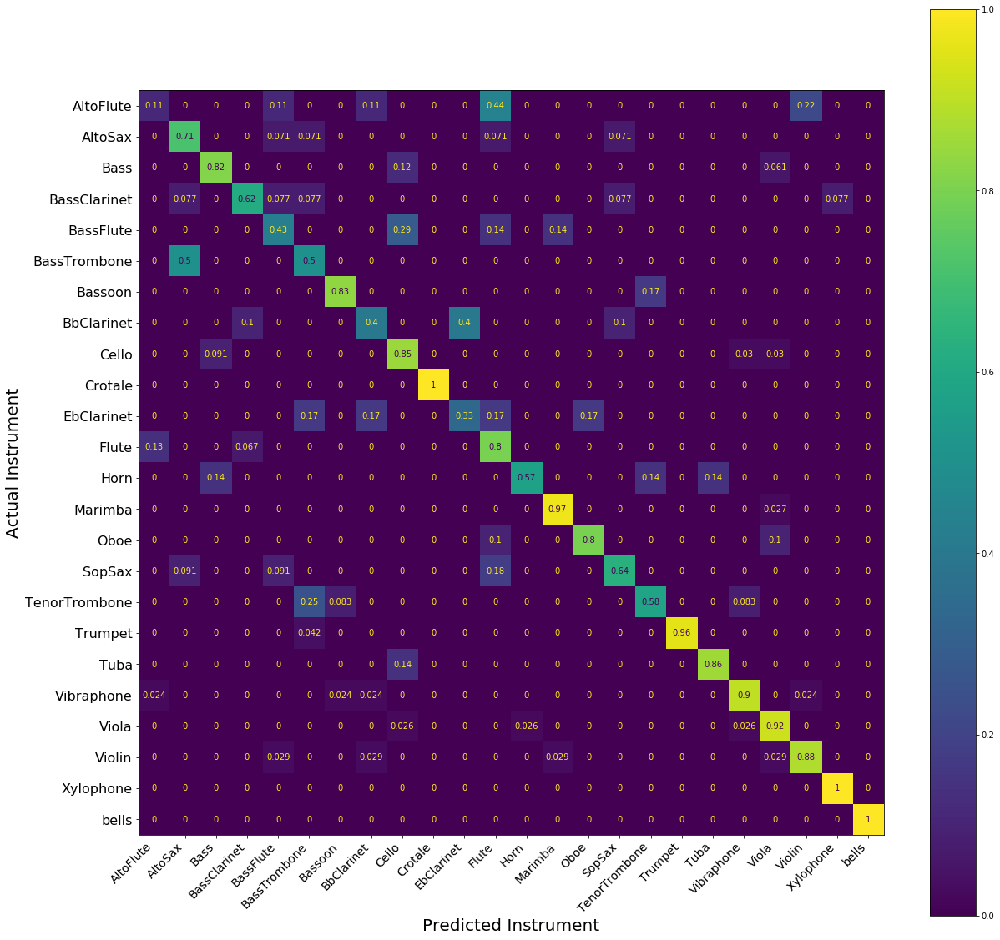

# instrument-classifier
Uses tree-based machine learning to classify audio samples by musical instrument.

### Data Sources

[University of Iowa Electronic Music Studios Musical Instrument Sample Database](http://theremin.music.uiowa.edu/MIS-Pitches-2012)

[UK Philharmonia Orchestra Sound Samples](https://www.philharmonia.co.uk/explore/sound_samples)

### Data Technologies Used

Python

  - BeautifulSoup for web scraping
  - pandas for data wrangling
  - librosa for audio processing
  - matplotlib for visualization

AWS

 - S3 for raw audio samples
 - RDS (MySQL) for signal-processed data

### Under the Hood

Onset detection is used to isolate the time of the attack. Onset detection is done by finding peaks of the onset strength as computed by librosa.

The spectral content in four audio frames near the attack is measured across 28 dimensions, giving a 112 dimensional representation of each sample. These 28 dimensions include mel frequency cepstrum coefficients, as well as chromatic data. The reason for looking at chromatic data both at and after the attack is to measure the decay rate of harmonics. The following chromogram illustrates the die off of other harmonics of a Bb being played on flute:

This resulting representation is then classified using XGBoost with 500 estimators.
The classifier was trained on 24 distinct instrument types representing common orchestral music. XGBoost was compared with chosen other tree-based methods and outperformed them in classification accuracy.

### Results

Around 25% of samples were held out as test data. We obtained an 83% accuracy rate on test data, which is a 4.5 times improvement over the baseline model. It seems to perform best on percussion instruments, which is to be expected since the relevant spectral information is temporally located close to the attack.

### Future Work

This work could easily be improved by expanding the training set of audio samples, both of the 24 instruments already included, and of other non-orchestral instruments. It may also be worthwhile to build onset detection into the machine learning pipeline.
